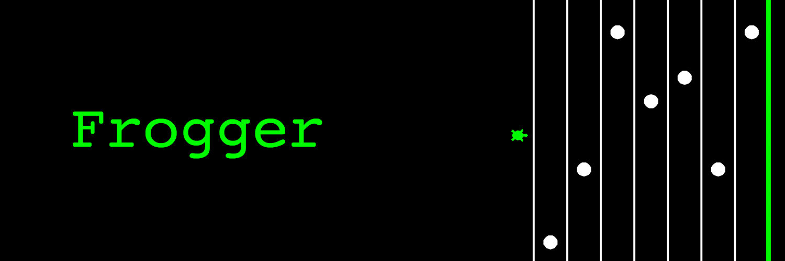

# Hackbright Scholarship Application 
#### Cohort start date: September 30th, 2019

Thank you for taking the time to review my application. This file contains instructions for installing my program, playing the frogger game, and what improvements were made to my code since it was submitted as a final project in the Prep Course. I hope you enjoy playing! 



## Getting Started 

#### Installation

Download python file and run on your machine. 

#### Game Play

The objective of Frogger is to cross to the green finish line without colliding with the bouncing balls. 

```
Give examples
```

## Code Improvements

#### Random speed and ball direction function added
#### Removal of unneccesary functions
#### Cleaned up formatting
#### Corrected flashing win message 


## Acknowledgements 
Special thanks to:  

**Inhye Baik**    
For taking the time to review my code, provide valuable feedback, and share her experiences as a Hackbrighter.  

**Danielle Yasso**   
For grabbing a coffee with me to share her experiences as a Hackbrighter, her job search afterwards, and what she has accomplished since completing the program. 

**Bianca Gandolfo**  
For sharing her experiences at Hack Reactor, what she is doing now, and how she is mentoring with Girls Who Code. 

I am so grateful to all these women for their kindness, words of encouragement, and support. I can't to be part of the women in tech community. 
