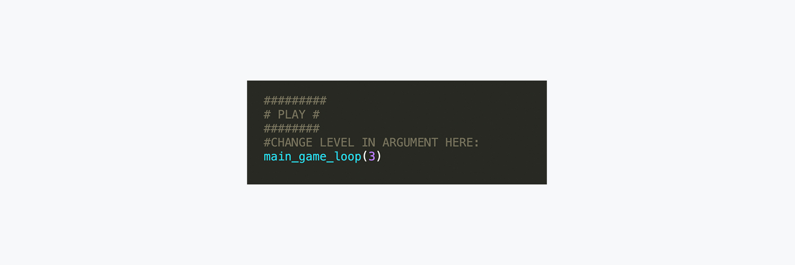

# Hackbright Scholarship Application 
#### Cohort start date: September 30th, 2019

Thank you for taking the time to review my application. This file contains instructions for installing my program, playing the frogger game, and the improvements that were made to my code since it was submitted as a final project in the Prep Course. I hope you enjoy playing! 

## Getting Started 

#### Installation

Download the python file and run it on your machine. When the file is running properly, a game board should appear that looks like this: 

#### Game Play

The objective of Frogger is to cross to the green finish line without colliding with the bouncing balls. If you hit one of the balls your frog will be sent back to start. Reach the green line and you win!

#### Game Controls

Use your keyboard arrows to control your frog. You may move up, downn, forwards, and backwards.

#### Change the level of the game

You may increase the speed of the balls by updating the argument provided in the main game loop. I reccommend starting with level three and incrementing up from there. 

In the screenshot below, you can see where to update the level of the game. 

## Code Improvements

#### Random speed and ball direction functionality added
I wanted to be sure that each time a user played the game that it would be a different experience. In order to achieve this, I created a list of all the possible speeds and directions that the balls could go and used random to generate a random float to be applied to the movement of the balls. 

#### Removal of unneccesary functions
The objective of Frogger is to cross to the green finish line without colliding with the bouncing balls. 

#### Cleaned up formatting
The objective of Frogger is to cross to the green finish line without colliding with the bouncing balls. 

#### Corrected flashing win message 
The objective of Frogger is to cross to the green finish line without colliding with the bouncing balls. 

## Acknowledgements 
Special thanks to:  

**Inhye Baik**    
For taking the time to review my code, provide valuable feedback, and share her experiences as a Hackbrighter.  

**Danielle Yasso**   
For grabbing a coffee with me to share her experiences as a Hackbrighter, her job search afterwards, and what she has accomplished since completing the program. 

**Bianca Gandolfo**  
For sharing her experiences at Hack Reactor, what she is doing now, and how she is mentoring with Girls Who Code. 

I am so grateful to all these women for their kindness, words of encouragement, and support. I can't to be part of the women in tech community. 
